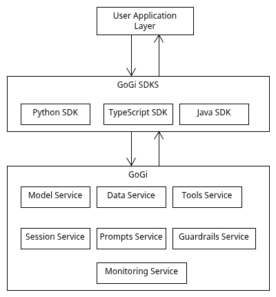

# gogi[AI]

gogi is a Go based platform for Generative AI/Agentic  applications. In other words, gogi
is an infrastructire layer that supports applucations that use LLM/ML models.
Schematically, this is shown below.



gogi evolves around a number of services.

- Model service
- Data service
- Tools service
- Session service
- Prompt service
- Guardrails service
- Monitoring service


## How to install locally

The best and easiest way to use the platform is via Docker
Alternatively, you should install the requirements and start the gRPC server:

```

go run gogi/main.go 
```

Unless you do some sort of development on the platform itself, you will need one of the supported SDKs.
This is what your application uses to interact with the platform:

- Python
- Java
- TypeScript

## SDKs

An SDK connects to the platform servieces.
This is done via an API Gateway. Here is an example
of how to use the Python SDK

```
```

The SDK connects to platform services through a single, stable API Gateway, and it makes those remote calls feel like local Python method calls.

When you create platform = GenAIPlatform(), it mainly configures how to reach the gateway (from an explicit gateway_url, or the GENAI_GATEWAY_URL env var, with a sensible default) . It does not immediately open network connections; service clients are lazy-initialized only when you first access them (for example, platform.sessions or platform.models) .

On first access, the SDK constructs the appropriate service client (such as SessionClient or ModelClient). That client opens a secure gRPC channel to the API Gateway and attaches routing metadata like x-target-service: sessions or x-target-service: models . Each method call then builds a Protocol Buffers request, sends it over gRPC through the gateway along with that metadata, and converts the Protocol Buffers response back into normal Python objects . The gateway reads the x-target-service metadata and routes the request to the correct backend service without needing to deserialize the binary payload .

This is the same pattern described in chapter 3 for the Model Service: ModelClient translates Python method calls into Protocol Buffer messages over gRPC to the gateway, and the gateway routes them to the Model Service .

## Services exposed

### Model service

The model service provides the following utilities

- Model discovery
- Custom model registration
- Prompt registration


---
**Remark: OpenAI message format as platform standard**


The adapters translate between the platform's internal format and each provider's format. But what format does the platform use? We need a canonical representation for messages that flows through the Model Service.

We use OpenAI's format. This isn't because OpenAI is special or because we're favoring them over other providers. It's because their format has become a de facto industry standard. When Anthropic documents their API, they explain differences from OpenAI's format. When vLLM serves open-source models, it provides an OpenAI-compatible endpoint. When developers discuss LLM integration, they typically assume OpenAI's conventions.


### Session service

The Session Service provides conversation memory: the ability to remember what's been said so that follow-up questions make sense and the assistant can reference earlier parts of the conversation. A session represents a conversation between a user and an AI application. At minimum, it needs to track who the conversation belongs to, when it started, and what's been said.

## Installation

Go server uses generated code. Install the required tools:

```
go install google.golang.org/protobuf/cmd/protoc-gen-go@latest
go install google.golang.org/grpc/cmd/protoc-gen-go-grpc@latest
export PATH="$PATH:$(go env GOPATH)/bin"
```

```
server/genai/v1/

protoc -I=proto \
  --go_out=. \
  --go-grpc_out=. \
  --experimental_allow_proto3_optional \ 
  proto/genai/v1/*.proto
```

Python SDK uses generated code


```
sdk/python/genai/_generated/

python -m grpc_tools.protoc \
  -I=proto \
  --python_out=. \
  --grpc_python_out=. \
  proto/genai/v1/*.proto

```  